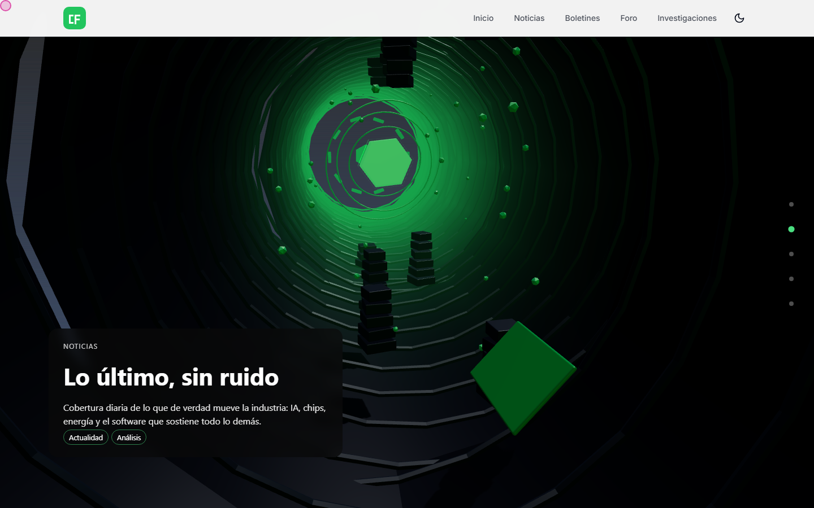
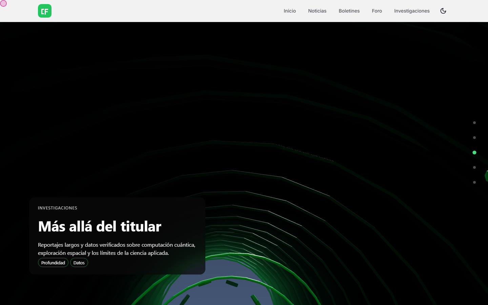
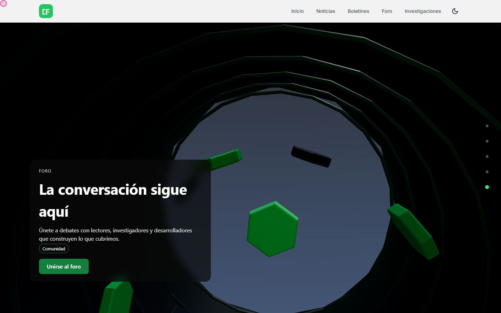
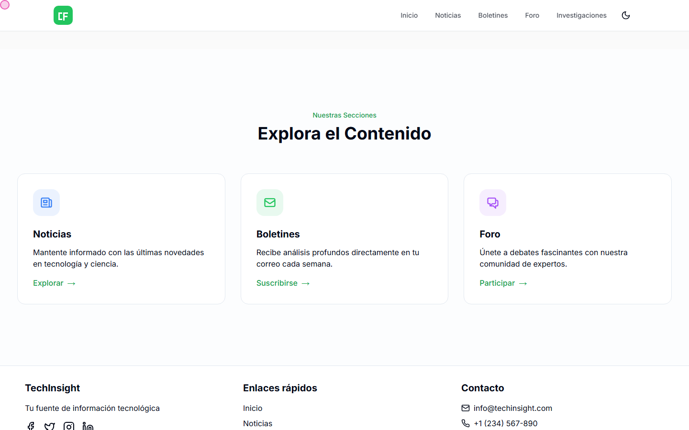

# Procedural 3D Scroll Experiences

[](https://www.npmjs.com/package/scroll-flyover)
[](https://github.com/jasc66/scroll-flyover/actions/workflows/ci.yml)

A Three.js/WebGL engine for cinematic, scroll-driven "fly through the world" landing
pages — usable two ways: as a **standalone library** (`npm install scroll-flyover
three`, no Claude involved) in any JS/framework project, or as a
[Claude Code](https://claude.com/claude-code) **skill** that interviews you and
generates a full build end-to-end.

`scroll-flyover` builds an immersive, scroll-scrubbed "fly through the world" landing
page using **live Three.js/WebGL** — no paid AI image or video generation, no external
asset generation services.

As the visitor scrolls, a real 3D camera flies along a spline path from outside each
procedurally-built "island" scene into its interior, then continues to the next scene
with no cuts — one continuous connected flight. All geometry, materials, lighting and
skies are generated by code (primitives + canvas-gradient textures), so there is zero
per-build cost and zero external dependency. The result is a stylized, low-poly /
geometric diorama world, not photoreal AI-generated art — that trade-off is stated to
the user up front, not discovered late.

## Example: a real production build

[**Live demo →**](https://alonso-portafolio-scrollflyover.vercel.app/) — a
spiral-ascent tower built with this skill, embedded in a bilingual Next.js portfolio.
Six sections, one continuous camera flight, no cuts:

|     |     |     |
| --- | --- | --- |
|  |  |  |
|  |  |  |

`references/production-lessons.md` documents what this specific build surfaced
(host-page CSS traps, pause-state bugs, look-at sign errors) that the original design
didn't anticipate.

A second real build: [**TechInsight →**](https://blog-tecno.vercel.app/) — a tech/science
news blog with a dark green tunnel flight through geometric shapes, landing on section
cards for each part of the site:

|     |     |
| --- | --- |
|  |  |
|  |  |
|  |     |

## Gallery: four more builds, four archetypes

Generated with this skill to demonstrate it isn't tuned to one subject or one camera
archetype — each uses a different journey structure and shape language from
`references/camera-archetypes.md` / `references/scene-recipes.md`. Full runnable source,
a local dev server, and the automated reproducibility/WCAG-contrast QA suite for these
four live in the separate [jasc66/scroll-flyover-demo](https://github.com/jasc66/scroll-flyover-demo)
repo, which depends on this skill's npm package rather than vendoring a copy of the
engine — an engine fix here reaches that gallery by bumping its dependency version, not
by hand-copying files.

[**Try all four live →**](https://scroll-flyover-demo.vercel.app)

|     |     |
| --- | --- |
|  |  |
| **[Alta Finca](https://scroll-flyover-demo.vercel.app/examples/nature-coffee-farm/)** — coffee farm · low-poly organic · island hop | **[Marco Estudio](https://scroll-flyover-demo.vercel.app/examples/architecture-studio/)** — architecture studio · geometric · corridor/tunnel |
|  |  |
| **[Nexo Ops](https://scroll-flyover-demo.vercel.app/examples/saas-nexo-ops/)** — project-mgmt SaaS · geometric · vertical descent | **[Ala Sneaker](https://scroll-flyover-demo.vercel.app/examples/product-ala-sneaker/)** — product launch · toy/rounded · orbit showcase |

Building these surfaced four real bugs in `references/scrub-engine.js` itself (the
scroll-pin effect didn't work out of the box, a lost WebGL context froze the flight
permanently, adjacent scenes' copy could overlap, copy text could fail WCAG contrast
against its own scene) — all fixed; see `references/production-lessons.md` for what
broke and why.

## Install

### As a library

The scrub engine is importable directly, for any project that wants the scroll/camera
machinery without going through Claude Code at all:

```bash
npm install scroll-flyover three
```

```js
import * as THREE from 'three';
import { mountScrollFlyover, makeRng } from 'scroll-flyover';

const handle = mountScrollFlyover(document.querySelector('#world'), {
  palette: { colors: ['#0e1c2b', '#1d3a52', '#c9d6df'], accent: '#e8a33d' },
  seed: 7,
  scenes: [
    {
      eyebrow: 'Chapter one',
      title: 'Arrival',
      body: 'One line of copy per scene.',
      build: (materials, textures, { rng, performance }) => {
        const group = new THREE.Group();
        group.add(new THREE.Mesh(new THREE.IcosahedronGeometry(2, 0), materials[1]));
        return group;
      },
    },
  ],
});

handle.dispose(); // on SPA route change / unmount
```

- **`three` is an optional peer dependency**, `>=0.152.0` (that's where
  `renderer.outputColorSpace` landed; verified against 0.152.0 through 0.186.0). It is
  marked optional so `npx scroll-flyover` skill installs don't pull it in — install it
  yourself when using the library entry point.
- **ESM only, browser only.** `mountScrollFlyover` touches `window`/`document` on call,
  so under Next.js import the component with `dynamic(..., { ssr: false })`.
- **The container must be a normal-flow element**, not `position: sticky` — the engine
  sets its height and mounts its own sticky wrapper inside. See the comments in
  `references/scrub-engine.js` for why.
- Each scene's `build(materials, textures, { rng, performance, shapeLanguage, palette })`
  returns a `THREE.Group`. Use the provided `rng` (never `Math.random()`) so builds stay
  reproducible. `references/scene-recipes.md` has copy-pasteable builders.
- **Scene copy is escaped, not interpolated as HTML** — safe to feed from a CMS, but
  markup in `title`/`body`/`tags` renders literally rather than as tags.
- The engine's own UI strings (the route rail's `aria-label`s) default to English.
  Override them to match the host page's language:
  ``labels: { goToScene: (i, total) => `Ir a la escena ${i} de ${total}` }``
- **Theming (opt-in, since 1.2.0):** the copy overlay's colors, blur, and radii are
  inline styles whose *values* are `var(--sf-x, <default>)`, not literals — set any of
  these as a CSS custom property on `container` (or an ancestor, they inherit like
  `color`) to retheme without touching the engine file. Untouched, every default
  reproduces the original hardcoded look exactly.

  | Custom property | Default | Affects |
  | --- | --- | --- |
  | `--sf-overlay-bg` | `rgba(10,10,16,0.62)` | copy panel background scrim |
  | `--sf-overlay-blur` | `6px` | copy panel backdrop blur |
  | `--sf-overlay-radius` | `12px` | copy panel corner radius |
  | `--sf-overlay-padding` | `1.1em 1.3em` | copy panel padding |
  | `--sf-text-color` | `#fff` | copy panel text color |
  | `--sf-tag-border` | `rgba(255,255,255,0.5)` | tag pill border |
  | `--sf-cta-bg` | the scene's palette accent | CTA button background |
  | `--sf-cta-text-color` | computed for contrast against the accent | CTA button text |
  | `--sf-cta-radius` | `8px` | CTA button corner radius |
  | `--sf-rail-dot` | `rgba(255,255,255,0.35)` | route rail dot (inactive) |
  | `--sf-rail-dot-active` | `#fff` | route rail dot (active) |
  | `--sf-rail-gutter` | `74px` | width reserved on the right so copy clears the rail |
  | `--sf-panel-inline` | `6%` | copy panel inset from the left edge |
  | `--sf-panel-bottom` | `10%` | copy panel inset from the bottom |
  | `--sf-panel-max-width` | `440px` | copy panel maximum width |
  | `--sf-title-size` | `clamp(1.35rem, 5.2vw, 2rem)` | scene title font size |
  | `--sf-body-size` | `clamp(0.9rem, 3.4vw, 1rem)` | scene body font size |

  Set `--sf-rail-gutter` to `0px` if you hide the route rail — it exists to keep the
  copy panel from running underneath the rail's 44px tap targets on narrow screens.

  `--sf-cta-bg`/`--sf-cta-text-color` override the WCAG-checked defaults (see
  "Status" below) — if you set them, you're responsible for the contrast between them.

- **Viewport handling (since 1.4.0).** The pinned wrapper is `100dvh` with a `100vh`
  fallback, so it tracks a mobile URL bar instead of standing taller than the visible
  area. The scroll length is rebuilt when the viewport *width* changes — rotation, or a
  resized window — and the visitor's position in the flight is preserved across that
  rebuild. Height-only changes are deliberately ignored: on mobile those fire
  continuously as the URL bar collapses while scrolling, and re-laying out on them
  would fight the visitor's own scroll. The copy panel and rail also honour
  `env(safe-area-inset-*)`, so a notch or home indicator does not sit on the copy.

- **Config is validated before anything renders (since 1.5.0).** Mistakes in the config
  object are reported as `scroll-flyover:` errors naming the property you got wrong,
  instead of surfacing as a Three.js stack trace — or, worse, as a page that renders
  black with no error at all. Validated: the container (a `querySelector` that returned
  `null` is the common one), `palette.colors`, `palette.accent` (must be hex, because
  the CTA's text color is picked by measuring its luminance), every scene's `build`
  function and its return value, `seed` (a non-numeric seed silently collapses to `0`,
  making every such build identical), `dwellWeight` (`0` divides by zero and renders
  nothing), `layout`'s return shape, `photos`, and `labels.goToScene`. Unrecognised
  `performance`/`cameraFeel` values warn rather than throw, since they still render a
  correct page. `shapeLanguage` is deliberately *not* validated — it is passed straight
  through to your scene builders, so it may carry a vocabulary of your own.

#### Exported helpers

Beyond `mountScrollFlyover`, the engine's deterministic pieces are importable on their
own — useful when building custom layouts, or checking your own colors against the same
rules the overlay uses. All are pure functions with no DOM or WebGL dependency.

| Export | Signature | What it's for |
| --- | --- | --- |
| `makeRng` | `(seed?) => () => number` | The seeded RNG (mulberry32) every scene builder must use instead of `Math.random()`. |
| `relativeLuminance` | `(hex) => number` | WCAG relative luminance. Accepts `#rgb` and `#rrggbb`, with or without the `#`. |
| `readableTextColor` | `(hex) => '#000' \| '#fff'` | Picks the text color that clears WCAG AA against a background. Worst case is 4.58:1, at the crossover. |
| `escapeHtml` | `(value) => string` | The escaping applied to all scene copy. |
| `layoutAnchors` | `(count, spacing?, arcHeight?) => Vector3[]` | The default island-hop scene layout — wrap or replace it via `config.layout`. |
| `sceneControlPoints` | `(anchor, forwardDir, radius) => Vector3[]` | The approach/dive/depart triple the camera path is built from. |
| `buildWorldCurve` | `(anchors, radius) => CatmullRomCurve3` | Turns a set of anchors into the flight path. |
| `buildDwellEasing` | `(sceneCount, dwellWeight?) => (t) => number` | The scroll→curve remap that paces the flight. |
| `nearestDwellCenter` | `(sceneCount, t) => number` | The resting point the `prefers-reduced-motion` path snaps to. |

### As a Claude Code skill

```bash
npx scroll-flyover
```

Copies `SKILL.md` and `references/` into `~/.claude/skills/scroll-flyover`. Restart
Claude Code (or start a new session) to pick it up.

`--dir` installs somewhere else instead — the path names the skill's own folder, which
receives `SKILL.md` and `references/` directly:

```bash
# this project only, so the skill can be committed alongside the code
npx scroll-flyover --dir .claude/skills/scroll-flyover

# anywhere at all
npx scroll-flyover --dir ./vendor/scroll-flyover
```

`--dir` makes the files reachable by other agents, but be clear about what that does
and does not buy. `SKILL.md` uses Claude Code's frontmatter format, its Step 1
interview is written around the `AskUserQuestion` tool, and its Step 8 accessibility
audit asks for an `accessibility-reviewer` subagent — so another agent will not run
this as a first-class skill, and those two steps need a human to drive them instead.
Everything else is portable: the remaining six steps and all 75KB of `references/`
are plain Markdown that any agent able to read files on request, or any person, can
work from directly.

`npx scroll-flyover --help` lists the flags.

Or clone the repo directly:

```bash
git clone <this-repo-url> ~/.claude/skills/scroll-flyover
```

Or as a submodule / subtree of an existing skills collection. Claude Code picks up any
folder under `~/.claude/skills/` (or a project's `.claude/skills/`) containing a
`SKILL.md` with the right frontmatter automatically — see `SKILL.md` for the full
skill definition and `references/` for the copy-pasteable Three.js patterns it's built
from.

## What's in here

- `SKILL.md` — the skill itself: the interview flow, build steps, and a large Gotchas
  section for when a build looks basic, jerky, or breaks in a host page.
- `references/scene-recipes.md` — primitive/material/canvas-texture building blocks
  per shape language (low-poly organic, geometric/architectural, toy/rounded).
- `references/camera-path.md` — the Catmull-Rom spline, per-scene control points,
  dwell-time easing, curvature-based banking.
- `references/camera-archetypes.md` — six journey structures (island hop, continuous
  terrain, vertical descent, corridor, orbit showcase, spiral ascent) and when to pick
  each.
- `references/visual-fidelity.md` — the difference between "tutorial demo" and
  "designed": tone mapping, procedural environment maps, bevels, bloom, shadows.
- `references/materials.md` — palette-derived procedural materials (marble, wood,
  water, rim glow, sky dome) and a per-performance-tier budget.
- `references/ux-principles.md` — the cognitive-science backing for the skill's
  interview scope, scene count, progress rail, and tap targets.
- `references/production-lessons.md` — gotchas from a real production build that
  aren't covered anywhere else: host-page CSS traps that break the scroll illusion
  (`position: sticky` + `overflow-x`), a shared pause-state flag freezing the flight,
  camera look-at sign traps, easing inertia for smooth transitions, loader emergency
  exits, keeping a 3D-tuned color separate from its WCAG-checked HTML variant,
  `pointer-events` bugs on overlapping opacity-toggled panels, and headless WebGL2 QA
  flags.
- `references/scrub-engine.js` — a portable, config-driven scroll engine (scene graph
  setup, spline playback, copy fade wiring, route-rail progress indicator, optional
  user-photo textures, resize/reduced-motion/context-loss handling, mobile performance
  downgrade). Framework-agnostic; see `production-lessons.md` for when to reimplement
  its mount function instead of adapting it as-is (e.g. a host app with its own i18n).
- `references/index-template.html` — a minimal standalone page that mounts the engine
  via a free Three.js CDN import map.
- `references/qa-reproducibility.mjs` — automates the SKILL.md Step 8
  reload-reproducibility check (Playwright).
- `test/` — unit tests for the engine's deterministic logic (seeded RNG, WCAG contrast
  picker, dwell easing, camera curve, HTML escaping, config validation). `npm test`,
  no browser needed.
- `scripts/` — `serve.mjs` (dependency-free static server, because `file://` blocks the
  template's ES module imports), `qa.mjs` (serves and runs the reproducibility check in
  one command), `check-package.mjs` (asserts the published tarball still carries its
  entry points).

## Testing

```bash
npm test          # unit tests — pure logic, fast, no browser
npm run qa        # renders references/index-template.html in Chromium, compares reloads
npm run qa:a11y   # drives the overlay by keyboard, checks focus/ARIA/button defaults
npm run serve     # static server, to open the template by hand
npm run check     # what CI runs, minus the browser
```

`npm run qa` needs a browser once: `npx playwright install chromium`.

Every push and pull request runs the unit tests on Node 20 and 22, against **both ends
of the declared `three` range** (0.152.0 and latest), plus the reproducibility QA, an
installer smoke test, and the tarball-contents check. The unit tests exist because this
project's failure mode is subtle: a sign flip in `sceneControlPoints` or a shifted
contrast constant still renders a page, still passes a screenshot comparison, and is
quietly wrong. Writing them surfaced exactly that — see 1.5.0 in
[`CHANGELOG.md`](CHANGELOG.md).

## Accessibility QA

The final QA step (SKILL.md Step 8) invokes an `accessibility-reviewer`-style agent
against the finished build's HTML overlay — the WebGL canvas itself is out of scope
(it's a rendered picture, not semantic content), but the copy overlay, CTA and
route-rail buttons, the crawlable SEO block, and the `prefers-reduced-motion` fallback
all are. Findings are treated as QA failures to fix before calling a build done, not
deferred. This requires the `Agent` tool, listed in `SKILL.md`'s `allowed-tools`.

That step is for a build you're making with this skill. The engine's own contrast rule
is covered here instead: `readableTextColor` is asserted to clear the 4.5:1 AA floor
across a sweep of several thousand backgrounds, including a dense walk along the grey
axis where the worst case actually lives. Spot-checking a handful of colors misses it —
that sweep is what caught the AA gap fixed in 1.5.0.

The example gallery in
[jasc66/scroll-flyover-demo](https://github.com/jasc66/scroll-flyover-demo) is
additionally covered by an automated regression check (`npm run qa` there, also run in
CI on every push/PR) that renders each example's real WebGL scene and measures actual
rendered WCAG contrast against the composited result.

## Deliberate uniqueness

The single biggest risk with a skill like this isn't a usability bug — it's every
build looking like a sibling of the same Three.js tutorial demo, since builds share a
small set of shape-language vocabularies and a common primitive toolbox. `SKILL.md`'s
closing section addresses this head-on: push the interview past the generic subject
category, turn the one non-generic detail into a signature motif repeated across every
scene, and deliberately break exactly one visual convention per build. This is a lens
applied during the interview and scene-building steps, not a separate pipeline stage.

## Status

- **The skill itself** (`SKILL.md` + `references/`) is stable and has two kinds of
  evidence behind it: one real production build (the live portfolio linked above,
  hand-integrated into a bilingual Next.js/React app) and a 4-example gallery spanning
  nature, architecture, SaaS, and product-launch archetypes — built to demonstrate the
  skill generalizes past that one production build. This repo keeps only the gallery's
  preview screenshots (`examples/`); the runnable source lives in
  [jasc66/scroll-flyover-demo](https://github.com/jasc66/scroll-flyover-demo).
- **`references/scrub-engine.js`** has had real defects found and fixed by actually
  running builds through Playwright rather than eyeballing one scroll position — see
  `references/production-lessons.md` for what broke and why — and, since 1.5.0, by a
  unit suite over its deterministic logic. Both methods have paid: Playwright caught a
  WCAG contrast bug in the copy overlay and CTA button, and the unit suite then caught
  two more the screenshots could not (a shorthand-hex parse failure and a text color
  that fell 0.4 short of AA near the crossover). Every build made with the current
  engine file gets those fixes for free.
- **Automated checks run in this repo, on every push and pull request** — unit tests on
  Node 20 and 22 across both ends of the supported `three` range, the Playwright
  reproducibility QA against the real shipped template, an installer smoke test, and a
  check that the published tarball still carries its entry points. An earlier workflow
  here tested the example gallery and left with it when that gallery moved to the demo
  repo; nothing covered the engine itself until now, which meant an engine regression
  could reach npm before anything noticed.
- **`references/production-lessons.md`** is the running list of what production use
  surfaces that the original design didn't anticipate, and grows with each new build.
- **All four gallery examples are deployed live** at
  [scroll-flyover-demo.vercel.app](https://scroll-flyover-demo.vercel.app) — no
  clone/build step needed to see them. That repo depends on this skill's npm package
  (rather than vendoring a copy of the engine) and runs the reproducibility and
  WCAG-contrast checks in CI on every push/PR, so an engine regression of either kind
  fails automatically instead of waiting for someone to notice by eye — but only once
  the demo repo's pinned version is bumped and re-synced; it does not update itself
  automatically when this repo changes.
- **Released versions are documented in [`CHANGELOG.md`](CHANGELOG.md)**, and every
  published version has a matching `vX.Y.Z` git tag pointing at the tree that was
  actually cut. Semver here covers the library entry point and the `bin` installer;
  builds generated through `SKILL.md` vendor a frozen copy of the engine, so they are
  unaffected by an upgrade until they are regenerated.

## Contributing

Bug reports and pull requests are welcome — see [`CONTRIBUTING.md`](CONTRIBUTING.md).
If you are reporting a bug, the two facts worth including before anything else are
**which version or commit you have** and **whether you got a real WebGL2 scene or the
static fallback**: the engine degrades silently between the two, so the same
description can mean two unrelated problems. The
[bug report form](.github/ISSUE_TEMPLATE/bug_report.yml) asks for both.

## License

MIT
