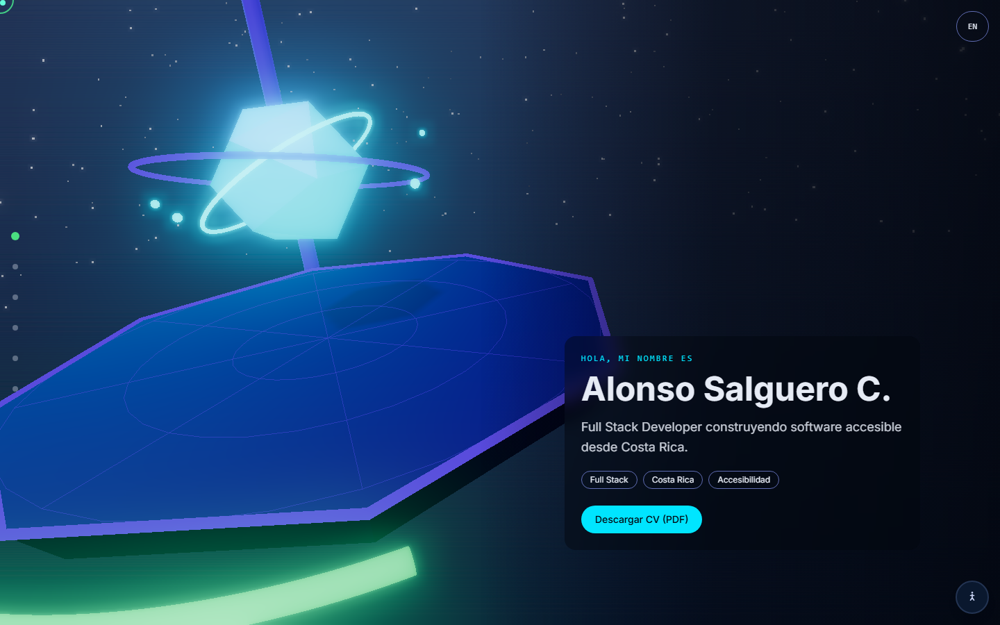
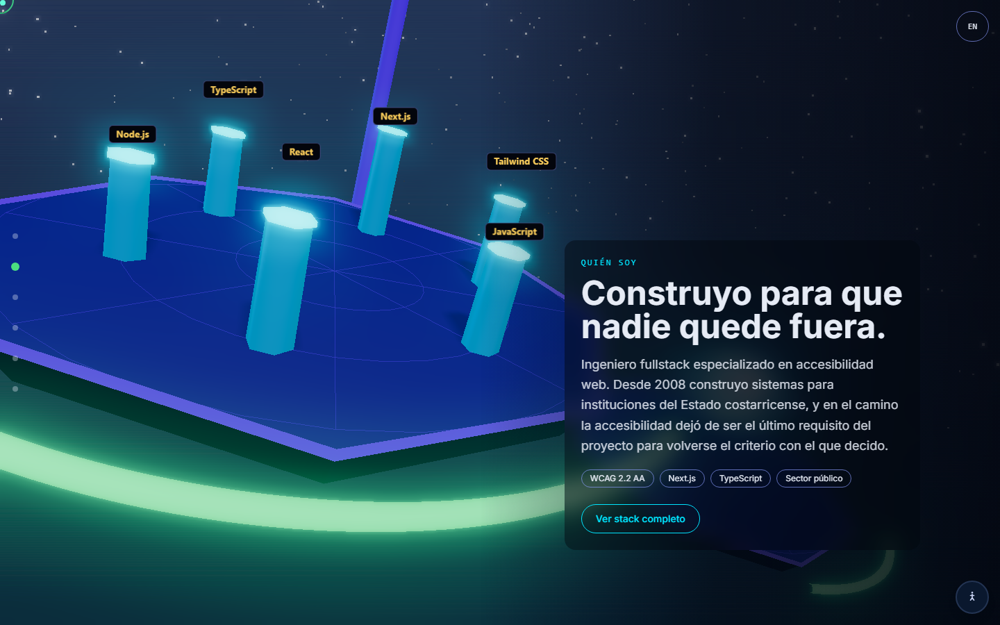
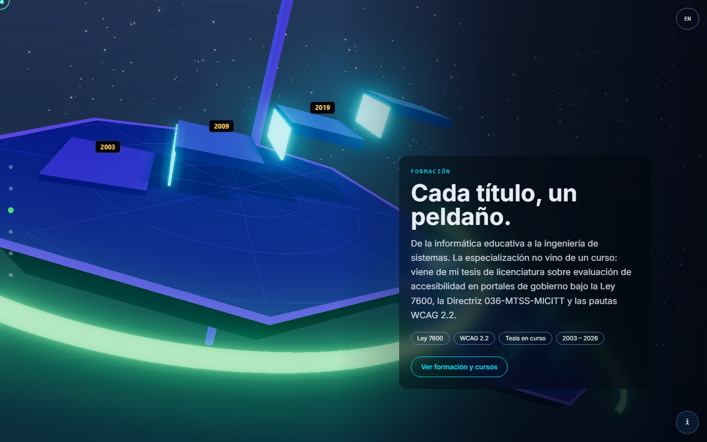
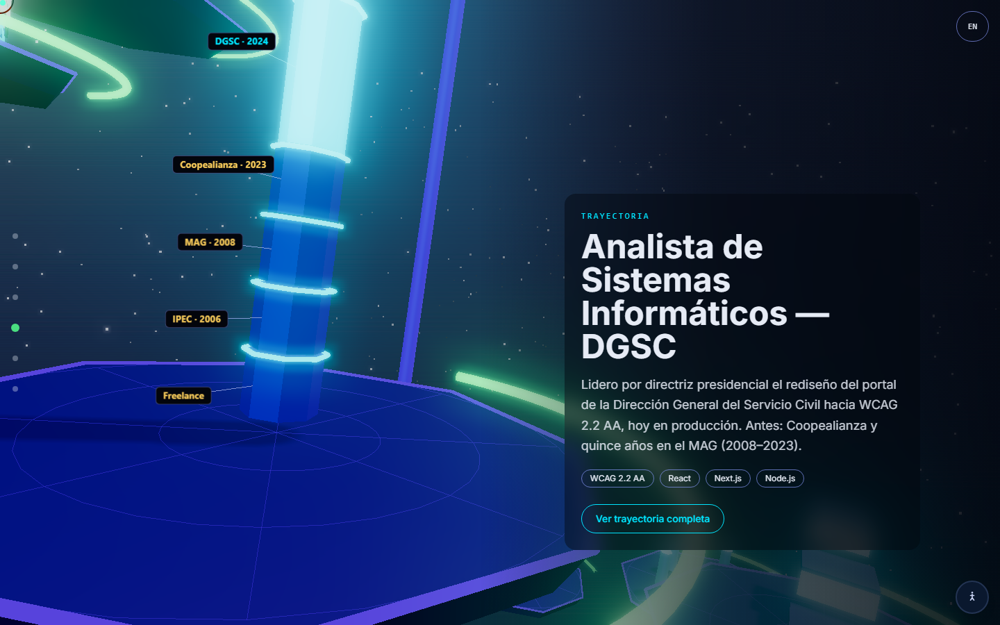
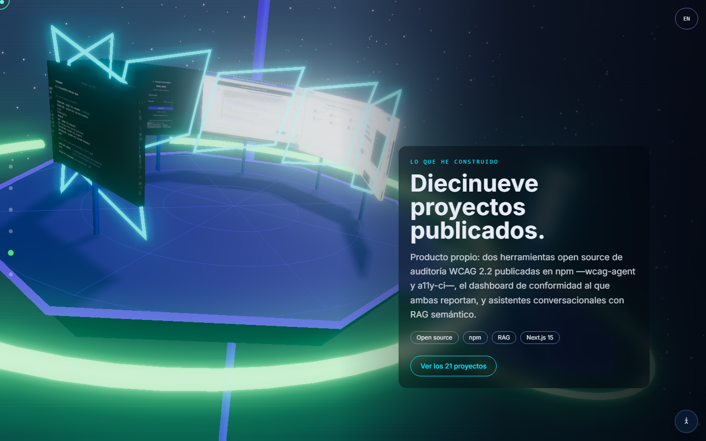
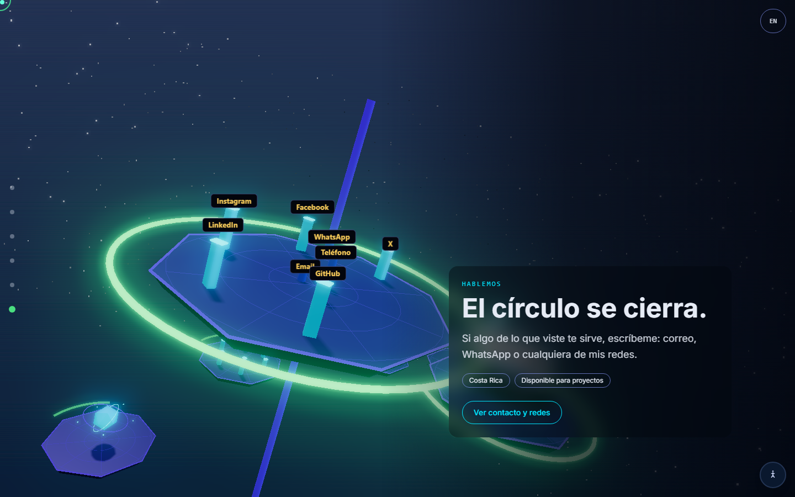
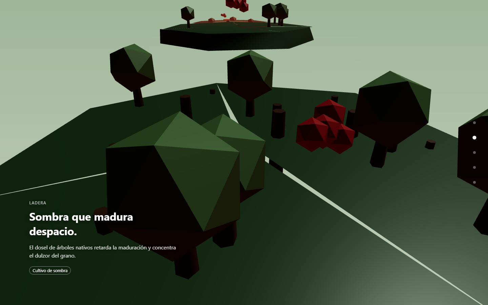
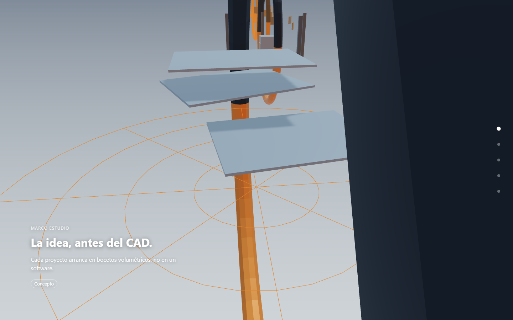
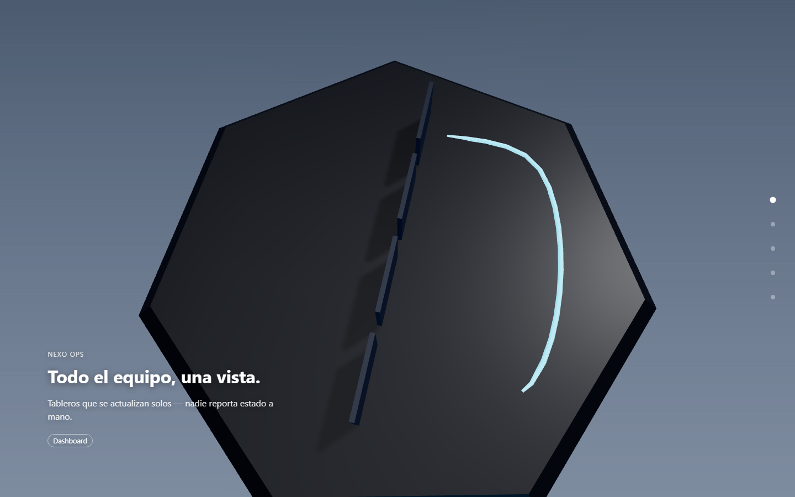
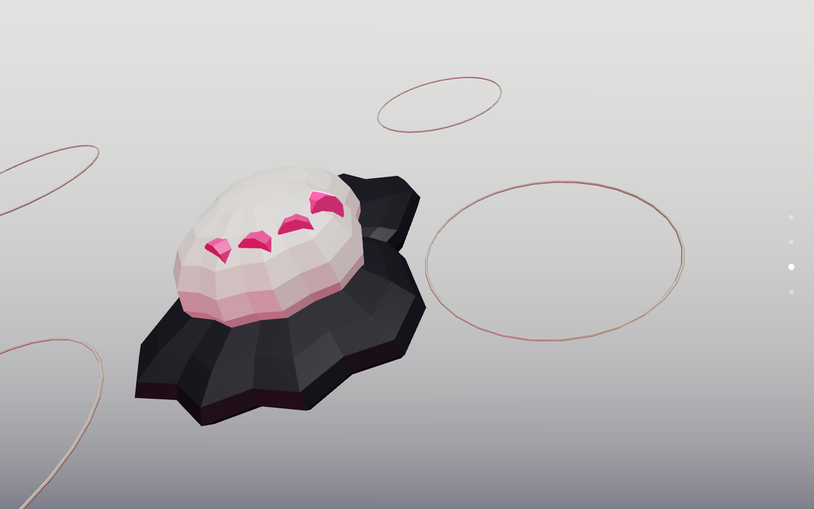

# Procedural 3D Scroll Experiences

[](https://www.npmjs.com/package/scroll-flyover)

A [Claude Code](https://claude.com/claude-code) skill for building cinematic,
scroll-driven Three.js worlds.

`scroll-flyover` builds an immersive, scroll-scrubbed "fly through the world" landing
page using **live Three.js/WebGL** — no paid AI image or video generation, no external
asset generation services.

As the visitor scrolls, a real 3D camera flies along a spline path from outside each
procedurally-built "island" scene into its interior, then continues to the next scene
with no cuts — one continuous connected flight. All geometry, materials, lighting and
skies are generated by code (primitives + canvas-gradient textures), so there is zero
per-build cost and zero external dependency. The result is a stylized, low-poly /
geometric diorama world, not photoreal AI-generated art — that trade-off is stated to
the user up front, not discovered late.

## Example: a real production build

[**Live demo →**](https://alonso-portafolio-scrollflyover.vercel.app/) — a
spiral-ascent tower built with this skill, embedded in a bilingual Next.js portfolio.
Six sections, one continuous camera flight, no cuts:

|     |     |     |
| --- | --- | --- |
|  |  |  |
|  |  |  |

`references/production-lessons.md` documents what this specific build surfaced
(host-page CSS traps, pause-state bugs, look-at sign errors) that the original design
didn't anticipate.

## Gallery: four more builds, four archetypes

Generated with this skill to demonstrate it isn't tuned to one subject or one camera
archetype — each uses a different journey structure and shape language from
`references/camera-archetypes.md` / `references/scene-recipes.md`. Full runnable source,
a local dev server, and the automated reproducibility/WCAG-contrast QA suite for these
four live in the separate [jasc66/scroll-flyover-demo](https://github.com/jasc66/scroll-flyover-demo)
repo, which depends on this skill's npm package rather than vendoring a copy of the
engine — an engine fix here reaches that gallery by bumping its dependency version, not
by hand-copying files.

[**Try all four live →**](https://scroll-flyover-demo.vercel.app)

|     |     |
| --- | --- |
|  |  |
| **[Alta Finca](https://scroll-flyover-demo.vercel.app/examples/nature-coffee-farm/)** — coffee farm · low-poly organic · island hop | **[Marco Estudio](https://scroll-flyover-demo.vercel.app/examples/architecture-studio/)** — architecture studio · geometric · corridor/tunnel |
|  |  |
| **[Nexo Ops](https://scroll-flyover-demo.vercel.app/examples/saas-nexo-ops/)** — project-mgmt SaaS · geometric · vertical descent | **[Ala Sneaker](https://scroll-flyover-demo.vercel.app/examples/product-ala-sneaker/)** — product launch · toy/rounded · orbit showcase |

Building these surfaced four real bugs in `references/scrub-engine.js` itself (the
scroll-pin effect didn't work out of the box, a lost WebGL context froze the flight
permanently, adjacent scenes' copy could overlap, copy text could fail WCAG contrast
against its own scene) — all fixed; see `references/production-lessons.md` for what
broke and why.

## Install

### As a Claude Code skill

```bash
npx scroll-flyover
```

Copies `SKILL.md` and `references/` into `~/.claude/skills/scroll-flyover`. Restart
Claude Code (or start a new session) to pick it up.

Or clone the repo directly:

```bash
git clone <this-repo-url> ~/.claude/skills/scroll-flyover
```

Or as a submodule / subtree of an existing skills collection. Claude Code picks up any
folder under `~/.claude/skills/` (or a project's `.claude/skills/`) containing a
`SKILL.md` with the right frontmatter automatically — see `SKILL.md` for the full
skill definition and `references/` for the copy-pasteable Three.js patterns it's built
from.

### As a library

The scrub engine is also importable directly, for projects that want the scroll/camera
machinery without generating a build through Claude Code:

```bash
npm install scroll-flyover three
```

```js
import * as THREE from 'three';
import { mountScrollFlyover, makeRng } from 'scroll-flyover';

const handle = mountScrollFlyover(document.querySelector('#world'), {
  palette: { colors: ['#0e1c2b', '#1d3a52', '#c9d6df'], accent: '#e8a33d' },
  seed: 7,
  scenes: [
    {
      eyebrow: 'Chapter one',
      title: 'Arrival',
      body: 'One line of copy per scene.',
      build: (materials, textures, { rng, performance }) => {
        const group = new THREE.Group();
        group.add(new THREE.Mesh(new THREE.IcosahedronGeometry(2, 0), materials[1]));
        return group;
      },
    },
  ],
});

handle.dispose(); // on SPA route change / unmount
```

- **`three` is an optional peer dependency**, `>=0.152.0` (that's where
  `renderer.outputColorSpace` landed; verified against 0.152.0 through 0.186.0). It is
  marked optional so `npx scroll-flyover` skill installs don't pull it in — install it
  yourself when using the library entry point.
- **ESM only, browser only.** `mountScrollFlyover` touches `window`/`document` on call,
  so under Next.js import the component with `dynamic(..., { ssr: false })`.
- **The container must be a normal-flow element**, not `position: sticky` — the engine
  sets its height and mounts its own sticky wrapper inside. See the comments in
  `references/scrub-engine.js` for why.
- Each scene's `build(materials, textures, { rng, performance, shapeLanguage, palette })`
  returns a `THREE.Group`. Use the provided `rng` (never `Math.random()`) so builds stay
  reproducible. `references/scene-recipes.md` has copy-pasteable builders.
- **Scene copy is escaped, not interpolated as HTML** — safe to feed from a CMS, but
  markup in `title`/`body`/`tags` renders literally rather than as tags.
- The engine's own UI strings (the route rail's `aria-label`s) default to English.
  Override them to match the host page's language:
  ``labels: { goToScene: (i, total) => `Ir a la escena ${i} de ${total}` }``

## What's in here

- `SKILL.md` — the skill itself: the interview flow, build steps, and a large Gotchas
  section for when a build looks basic, jerky, or breaks in a host page.
- `references/scene-recipes.md` — primitive/material/canvas-texture building blocks
  per shape language (low-poly organic, geometric/architectural, toy/rounded).
- `references/camera-path.md` — the Catmull-Rom spline, per-scene control points,
  dwell-time easing, curvature-based banking.
- `references/camera-archetypes.md` — six journey structures (island hop, continuous
  terrain, vertical descent, corridor, orbit showcase, spiral ascent) and when to pick
  each.
- `references/visual-fidelity.md` — the difference between "tutorial demo" and
  "designed": tone mapping, procedural environment maps, bevels, bloom, shadows.
- `references/materials.md` — palette-derived procedural materials (marble, wood,
  water, rim glow, sky dome) and a per-performance-tier budget.
- `references/ux-principles.md` — the cognitive-science backing for the skill's
  interview scope, scene count, progress rail, and tap targets.
- `references/production-lessons.md` — gotchas from a real production build that
  aren't covered anywhere else: host-page CSS traps that break the scroll illusion
  (`position: sticky` + `overflow-x`), a shared pause-state flag freezing the flight,
  camera look-at sign traps, easing inertia for smooth transitions, loader emergency
  exits, keeping a 3D-tuned color separate from its WCAG-checked HTML variant,
  `pointer-events` bugs on overlapping opacity-toggled panels, and headless WebGL2 QA
  flags.
- `references/scrub-engine.js` — a portable, config-driven scroll engine (scene graph
  setup, spline playback, copy fade wiring, route-rail progress indicator, optional
  user-photo textures, resize/reduced-motion/context-loss handling, mobile performance
  downgrade). Framework-agnostic; see `production-lessons.md` for when to reimplement
  its mount function instead of adapting it as-is (e.g. a host app with its own i18n).
- `references/index-template.html` — a minimal standalone page that mounts the engine
  via a free Three.js CDN import map.
- `references/qa-reproducibility.mjs` — automates the SKILL.md Step 8
  reload-reproducibility check (Playwright).

## Accessibility QA

The final QA step (SKILL.md Step 8) invokes an `accessibility-reviewer`-style agent
against the finished build's HTML overlay — the WebGL canvas itself is out of scope
(it's a rendered picture, not semantic content), but the copy overlay, CTA and
route-rail buttons, the crawlable SEO block, and the `prefers-reduced-motion` fallback
all are. Findings are treated as QA failures to fix before calling a build done, not
deferred. This requires the `Agent` tool, listed in `SKILL.md`'s `allowed-tools`.

That step is for a build you're making with this skill. The example gallery in
[jasc66/scroll-flyover-demo](https://github.com/jasc66/scroll-flyover-demo) is
additionally covered by an automated regression check (`npm run qa` there, also run in
CI on every push/PR) that renders each example's real WebGL scene and measures actual
rendered WCAG contrast — the same class of bug fixed in the WCAG contrast fix above.

## Deliberate uniqueness

The single biggest risk with a skill like this isn't a usability bug — it's every
build looking like a sibling of the same Three.js tutorial demo, since builds share a
small set of shape-language vocabularies and a common primitive toolbox. `SKILL.md`'s
closing section addresses this head-on: push the interview past the generic subject
category, turn the one non-generic detail into a signature motif repeated across every
scene, and deliberately break exactly one visual convention per build. This is a lens
applied during the interview and scene-building steps, not a separate pipeline stage.

## Status

- **The skill itself** (`SKILL.md` + `references/`) is stable and has two kinds of
  evidence behind it: one real production build (the live portfolio linked above,
  hand-integrated into a bilingual Next.js/React app) and a 4-example gallery spanning
  nature, architecture, SaaS, and product-launch archetypes — built to demonstrate the
  skill generalizes past that one production build. This repo keeps only the gallery's
  preview screenshots (`examples/`); the runnable source lives in
  [jasc66/scroll-flyover-demo](https://github.com/jasc66/scroll-flyover-demo).
- **`references/scrub-engine.js`** has had four real defects found and fixed, all by
  actually running builds through Playwright rather than eyeballing one scroll
  position — see `references/production-lessons.md` for what broke and why. The most
  recent was a WCAG contrast bug in the copy overlay and CTA button (hardcoded text
  color against an arbitrary scene background); every build made with the current
  engine file gets that fix for free.
- **`references/production-lessons.md`** is the running list of what production use
  surfaces that the original design didn't anticipate, and grows with each new build.
- **All four gallery examples are deployed live** at
  [scroll-flyover-demo.vercel.app](https://scroll-flyover-demo.vercel.app) — no
  clone/build step needed to see them. That repo depends on this skill's npm package
  (rather than vendoring a copy of the engine) and runs the reproducibility and
  WCAG-contrast checks in CI on every push/PR, so an engine regression of either kind
  fails automatically instead of waiting for someone to notice by eye — but only once
  the demo repo's pinned version is bumped and re-synced; it does not update itself
  automatically when this repo changes.

## License

MIT
